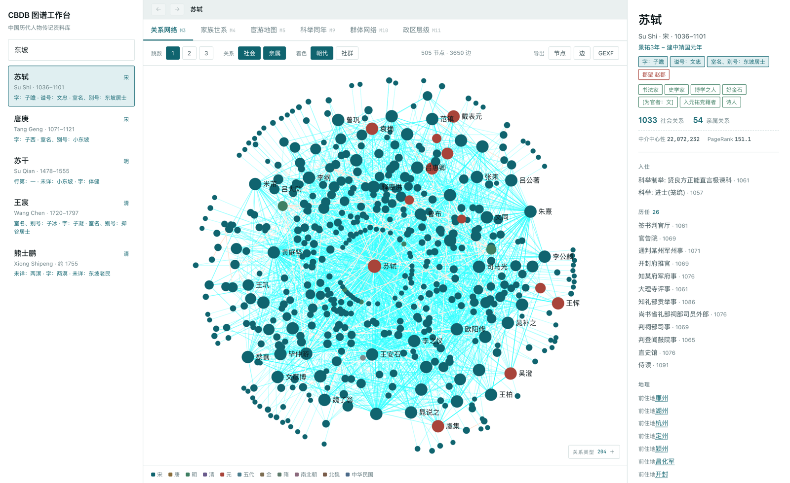
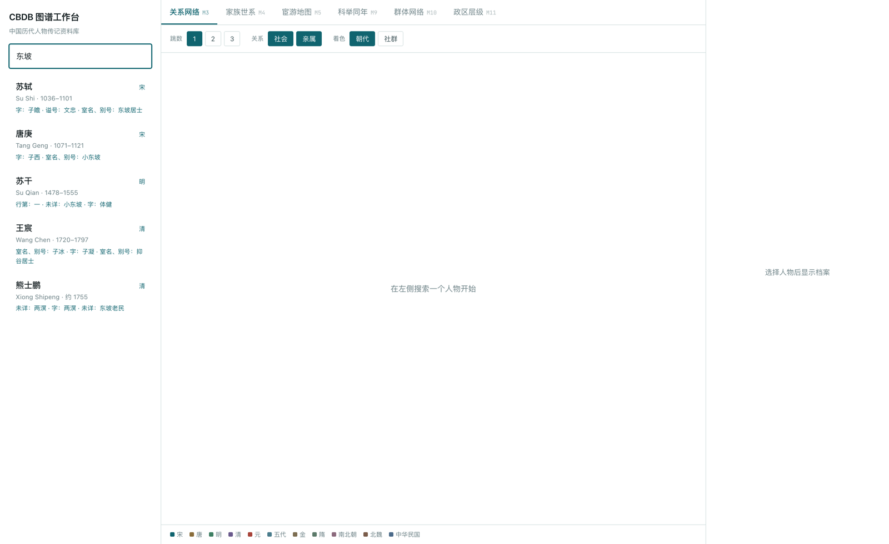
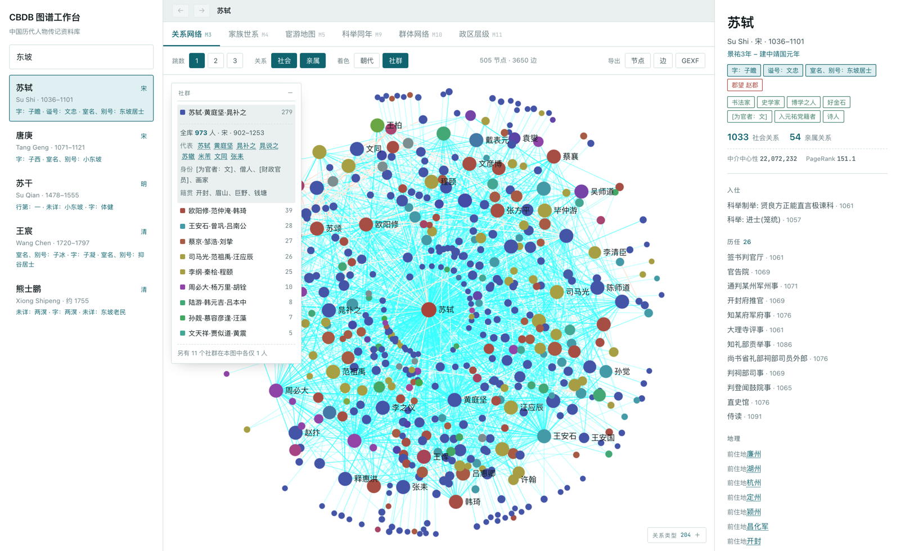
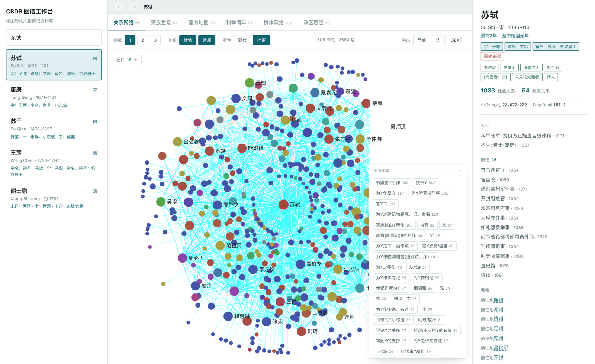
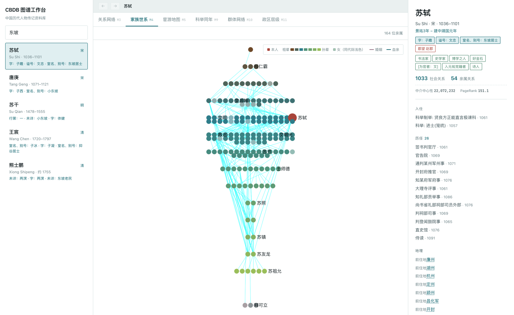
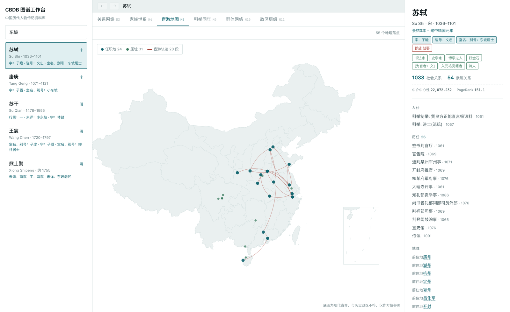
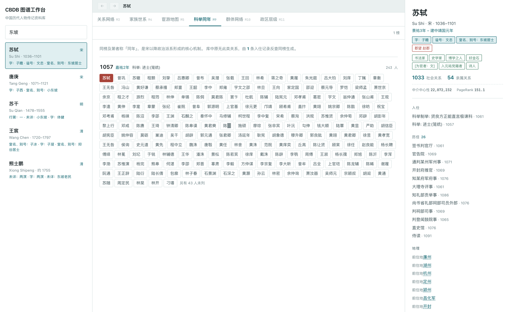
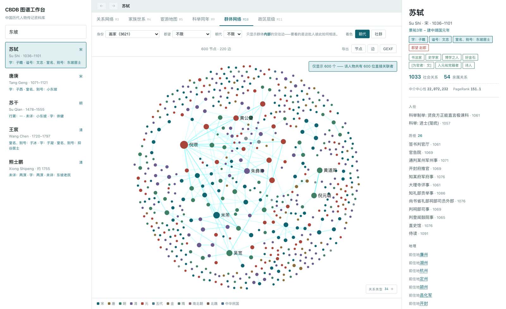
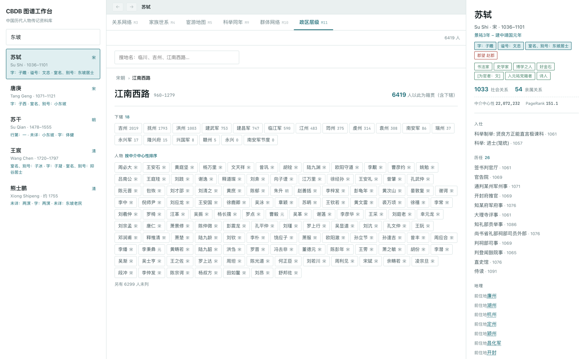

# CBDB 图谱工作台

把中国历代人物传记资料库（CBDB）从关系型数据库重建为可交互的知识图谱。

**入库规模：789,709 节点 · 2,541,114 关系 · 1,915 万属性**

CBDB 收录自先秦至民国的 66 万余人，但它是一个 SQLite 库——人物、亲属、社会交往、任官、著述
分散在 78 张表里靠外键相连。要看一个人的关系网络，关系型的表结构根本不适合表达。
而这份数据的形态，本来就是一张图。



---

## 功能

### M1 检索：字号别名皆可命中



库中有 **20.8 万条**字号别名。古籍里称「东坡」「子瞻」「文忠」远多于称「苏轼」，
所以检索必须认这些。命中的别名直接显示在结果里，你知道为什么出这个人。

**不用全文索引**——Lucene 对中文按单字切分，搜「东坡」会返回一堆带「坡」字的人，
苏轼反而排不进来。改用 TEXT 索引做四级精确匹配：本名精确 → 别名精确 → 本名前缀 → 别名包含。
66 万人的库，最差情况（单字查询）0.39 秒。

### M2 人物档案

右侧常驻。生平、字号别名、郡望、社会身份、入仕途径、历任官职、地理足迹、著述、史料注记，
年份同时给公元与**年号纪年**（史料里写的是「元丰三年」，不是 1080）。

### M3 关系网络

以一人为中心向外扩展 1–3 跳，按关系类型过滤。**悬停任一节点即显示它与中心人物的全部关系**
并高亮连线，点击钉住关系卡片，每条关系附史料出处。

CBDB 两类关系的方向约定相反，措辞按类型区分：
亲属写「王朝云 是 苏轼 的**妾**」，社会关系写「李白 —**赠诗、文**→ 杜甫」。

### M7 网络分析：算出来的社群对得上史书



GDS 分朝代跑 Louvain、中介中心性、PageRank，结果写回节点属性。
Louvain 只给数字 ID，所以补了**社群画像**：代表人物、规模、年代区间、主要身份、主要籍贯。

不做「苏门」「旧党」这类命名——那是史学判断不是数据能给的。但代表人物足以让人一眼认出：

| 社群标识 | 规模 | 史学对应 |
|---|---|---|
| 苏轼·黄庭坚·晁补之 | 973 | 苏门 |
| 欧阳修·范仲淹·韩琦 | — | 庆历党人 |
| 王安石·曾巩·吕南公 | — | 新党 |
| 司马光·范祖禹·汪应辰 | — | 旧党 |
| 朱熹·张栻·吕祖谦 | 1,249 | 道学集团（东南三贤） |

算法完全不知道什么是「理学」或「苏门」，纯靠 66,027 条交往边就把这些群体分了出来。
中介中心性排序前三是朱熹、苏轼、周必大。

时序上还能看到权力网络的世代转移（宋代 50 年滑窗）：
丁谓·杨亿 → 司马光·范纯仁 → 李邦彦·何㮚 → 周必大·陆游·张栻 → 刘克庄·史弥远 → 文天祥·贾似道。

### 关系类型筛选



列出本图全部关系名及数量（苏轼 1 跳有 204 种），点击即只保留该关系的边与其连到的节点，可多选。
亲属类用虚线边框 + 朱色，社会关系用石青。筛完直接导出的就是这个子图。

### M4 家族世系



按代分带的族谱布局。CBDB 自带四维亲属距离向量（up/down/mar/col），世代可直接推算。
**颜色编码代际**——深琥珀（祖辈）→ 石青（同辈）→ 浅绿（孙辈），明度单调递增；
性别降为次级编码（女性取同代际的浅色版）。按性别着色没有信息量，库中九成是男性。

### M5 宦游地图



任职地与居址落到地图上，有纪年的任职按时间连成轨迹。
苏轼的 55 个落点里，最南那个孤点是儋州——海南的贬所。

### M6 关系路径

任意两人之间的最短关系链，逐跳标注关系性质。
朱熹与辛弃疾之间是一跳直连：「答Y启」，书信往还。
这是史学上最有说服力的一类结果，它给出可核查的人际链条。

### M8 史料溯源

每条关系都能点开，看它出自哪本书、哪一页、哪一篇。这是 CBDB 相对其他人文图谱的杀手锏。

苏轼与楼钥之间有 9 条一模一样的「书跋由Y所作」——查下来不是冗余，
那是楼钥为苏轼写的九篇不同题跋（跋东坡西山诗、跋东坡行香子词、跋东坡三笑图赞……），
全收在《攻愧集》里，唯一的区分字段是篇目名。

### M9 科举同年



同榜及第者称「同年」，是宋以降政治派系形成的核心机制。库中原无此类关系，
由 26.5 万条入仕记录反查同榜生成，共 1,444 榜 96,377 人次。

苏轼的 1057 嘉祐二年榜：苏轼、苏辙、曾巩、程颢、张载、吕惠卿、曾布同榜，243 人，
欧阳修主考——中国科举史上最著名的一榜。

> **实现取舍**：不建人-人边。全库同年对数达 **1522 万**，比整个图现有的 254 万边还多 6 倍；
> 改建榜节点后只需 1,444 节点 + 96,377 边。

### M10 群体网络



按身份、郡望、朝代取一批人，**只看他们彼此之间**的交往。
选「画家（3,621）」得到的就是画家群体的内部网络，米芾、赵孟頫、倪瓒、朱德润居中。

「入元祐党籍者」315 人的内部网络里，核心是苏轼(191)、黄庭坚(119)、司马光(78)。
顺带发现**章惇也在这份名单里**——他是新党领袖、元祐党籍碑的主谋，
大概率是 CBDB 的标注问题，正是这工具该替史学者暴露的线索。

### M11 政区层级



搜地名 → 面包屑上溯 → 下钻到州县 → 看该地人物。**人数含下辖各级**，
问「江南西路有多少人」，答案包含抚州、临川，实测 6,419 人。

人物按中介中心性排序，江南西路排出来的是周必大、王安石、黄庭坚、杨万里、文天祥、曾巩、陆九渊
——宋代江西的全明星阵容。

### 子图导出

任何网络视图都能导出 CSV（节点 / 边）或 **GEXF**（Gephi 原生格式），
研究者可以拿去精修或写进论文。筛选后导出的就是所见子图。

---

## 技术栈

| 层 | 选型 | 关键考量 |
|---|---|---|
| 图数据库 | Neo4j 2026.07 Community | 254 万边远在单机舒适区，全量导入 7.5 秒 |
| 图算法 | GDS + APOC | Louvain / Betweenness / PageRank；APOC 负责子图抽取与导出 |
| 后端 | Spring Boot 3.5 · Java 21 | `Neo4jClient` 原生 Cypher，**不用 OGM 实体映射** |
| 缓存 | Caffeine | 热点人物反复被查，实测 0.12s → 0.01s |
| 网络图 | Sigma.js 3 + graphology | WebGL，ForceAtlas2 放 Web Worker |
| 地图 | ECharts 6 | 按需异步加载，首屏不受影响 |
| 前端 | Vue 3.5 + Vite 7 + Pinia | 图谱应用状态复杂，集中管理 |
| 部署 | Docker Compose | 单机，一条命令起来 |

**为什么不用 OGM**：知识图谱返回的是任意形状的子图，映射成固定 POJO 反而处处受限。
直接在 Cypher 里把结果拍平成 map，前后端只维护一种 `{nodes, edges}` 契约。

---

## 首次搭建

**仓库不含 CBDB 数据**（原始快照 571 MB，且属 CBDB 项目所有），需自行获取。

```bash
# 1. 配置
cp .env.example .env        # 填入 NEO4J_PASSWORD 与 NEO4J_HOME

# 2. 取数据：从 CBDB 官方下载 SQLite 快照放进 latest/
#    https://huggingface.co/datasets/cbdb/cbdb-sqlite
mkdir -p latest && mv ~/Downloads/cbdb_*.sqlite3 latest/

# 3. 建库：导出 → 繁转简 → 套用勘误 → 导入 → GDS 预计算
./neo4j/rebuild.sh

# 4. 起服务
./start.sh
```

依赖：Docker、Java 21、Maven、Node 20+、pnpm、Python 3（`pip install zhconv`）。

- 前端 http://localhost:5173
- API http://localhost:8080/api
- Neo4j Browser http://localhost:7474

---

## 数据管道

```
latest/*.sqlite3
  → export.sh              忠实转储为 CSV，不做任何改动
  → simplify.py            繁转简（库中只存简体）
  → apply_corrections.py   套用勘误表
  → import-docker.sh       neo4j-admin 批量导入，7.5 秒
  → gds.cypher             分朝代预计算社群与中心性，40 秒
```

**原始快照永不修改。** 勘误是管道里一个显式、可审计、可撤销的步骤——
删掉 `neo4j/corrections.tsv` 里的一行即撤销该修正，季度更新后自动重新套用。

**繁简转换不是可选项。** 库中人名 69% 简繁不同，不转换的话搜「苏轼」返回零结果，
因为库里存的是「蘇軾」。库中只保留简体，需要原繁体时从原始 SQLite 重新导出。

---

## 数据质量审计

```bash
./neo4j/audit.sh
```

用库中记载彼此校验：世代方向与生年是否矛盾、与朝代是否矛盾、卒年是否早于生年、父子年差是否异常。
只读，不改数据。

最有价值的一条命中不在人物数据，而在**关系码表本身**：

> CBDB 的代码约定里 `G+` 表向下（後裔）、`G-` 表向上（先祖）。直系码可作对照：
> `G+73`（七十三世孫）记为 `up=0, down=73`，方向正确。
>
> 唯独 `BG+8`（兄弟之八世孫）与 `BG+9`，把步数填进了 upstep 列。后果是：
> 苏轼的八世侄孙苏伯衡——一个 1329 年出生的明代人——会被算成苏轼的**八世祖**。

全表同逻辑扫描，这类错误恰好只有这两处。修正一个关系码，整条支系的方向错误随之消解。
另检出 219 组世代方向存疑、130 组朝代矛盾、5 例卒年早于生年，已确证的记入 `corrections.tsv`。

---

## 备份与迁移

```bash
./neo4j/dump.sh full          # 二进制全量，146 MB / 33 秒，需停机
./neo4j/dump.sh cypher        # Cypher 脚本，纯文本，跨版本可移植
./neo4j/dump.sh schema        # 只导结构（约束 + 索引）
./neo4j/dump.sh csv           # 618 MB，给 Excel / pandas
```

恢复到另一台机器：

```bash
./neo4j/restore.sh cbdb-YYYYMMDD-HHMM.dump ~/neo4j-new 7474
```

已实测验证：恢复后 789,709 节点 / 2,541,114 关系完全一致，19 个索引全部还原。
**GDS 算出的 `community` / `betweenness` / `pagerank` 是普通节点属性，随 dump 一起走，恢复后无需重算**；
但要再跑算法或用 `apoc.*`，目标机仍需装插件。

---

## 已知约束

- Neo4j Community 只允许一个用户库，导入目标必须叫 `neo4j`
- `docker compose` 须带 `-p cbdb`（目录名含中文时无法自动生成项目名）
- `neo4j-admin database import` 需停机且会覆盖目标库，不能用于增量更新
- 恢复时目标 Neo4j 版本必须 ≥ 源版本
- 重导数据后必须重启后端——Caffeine 缓存 TTL 6 小时会返回旧结果

---

## 数据来源

[CBDB 中国历代人物传记资料库](https://projects.iq.harvard.edu/cbdb)，
哈佛大学、北京大学、中央研究院合作维护。本项目仅做数据重组与可视化，不改变其学术归属。

README 中所有数字均来自快照 `cbdb_20260822` 实测。
